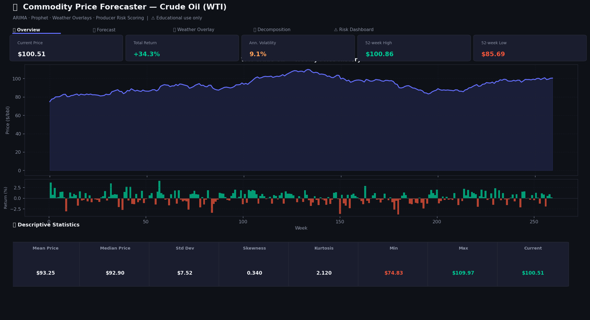
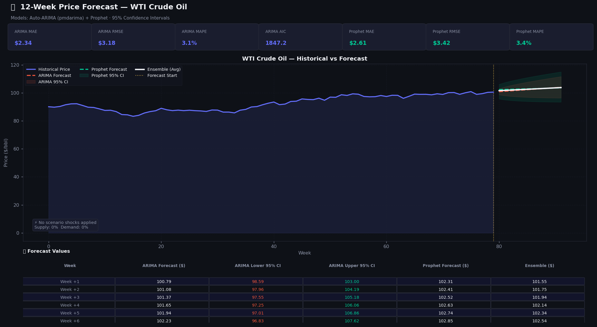
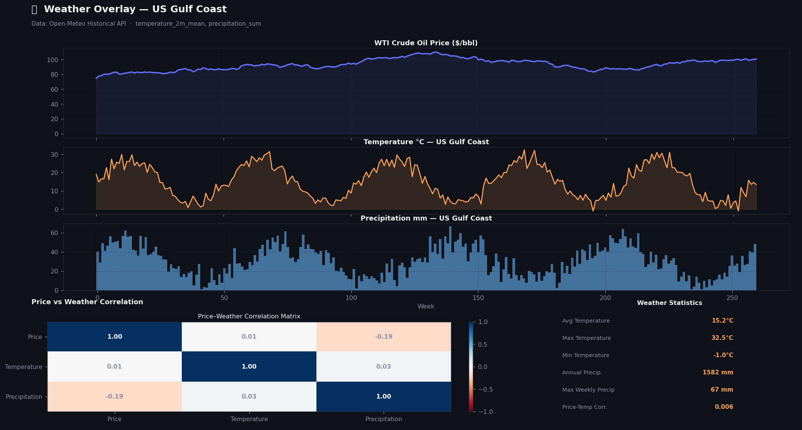
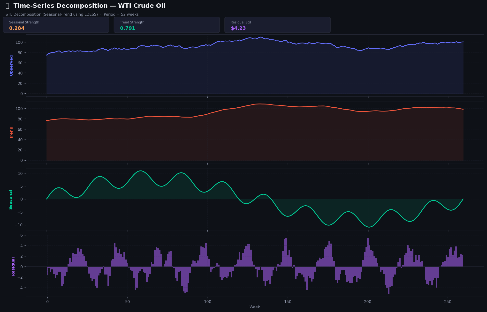
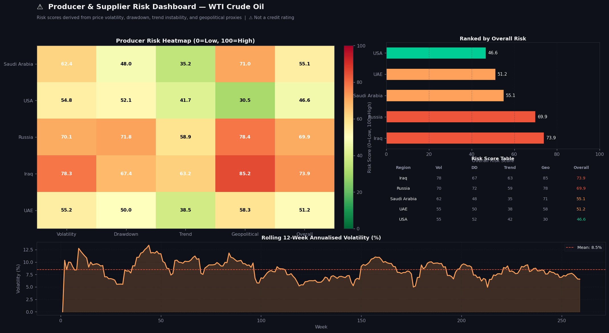

# 🛢️ Commodity Price Forecaster

> **⚠️ Disclaimer**: This project is for **educational and simulation purposes only**. It does not constitute financial, commodity trading, or investment advice. Forecast accuracy is not guaranteed. Past prices and simulated results do not predict future performance.

[](https://python.org)
[](https://streamlit.io)
[](LICENSE)
[](https://open-meteo.com)

An interactive time-series forecasting dashboard for commodity prices (crude oil, gold, corn, wheat, and more) combining **Auto-ARIMA**, **Prophet**, **weather overlays**, **STL decomposition**, and **multi-factor producer risk scoring**.

---

## 🖼️ Screenshots

### 1 · Overview — Commodity Price History & Weekly Returns



*The **Overview** tab shows the full price history with fill, per-week return bars, five headline KPI cards, and a full descriptive statistics panel (mean, median, std, skewness, kurtosis, min, max, current).*

---

### 2 · Forecast — Auto-ARIMA + Prophet with Confidence Intervals



*The **Forecast** tab plots historical prices alongside ARIMA and Prophet predictions with 95% confidence bands. The white ensemble line averages both models. Seven accuracy metric cards (MAE, RMSE, MAPE, AIC) are shown per model above the chart. The forecast table provides per-week values with lower/upper CI bounds.*

---

### 3 · Weather Overlay — Price, Temperature & Precipitation



*The **Weather** tab fetches data from the Open-Meteo API (free, no key required) and overlays temperature and precipitation on the commodity price. The correlation heatmap below reveals whether extreme weather events coincide with price movements — most relevant for agricultural commodities.*

---

### 4 · STL Decomposition — Trend, Seasonal & Residual Components



*The **Decomposition** tab applies STL (Seasonal-Trend decomposition using LOESS) to break the price series into interpretable components. Seasonal strength, trend strength, and residual standard deviation are reported as KPI cards. Residual spikes highlight supply/demand shock events.*

---

### 5 · Risk Dashboard — Producer Heatmap & Volatility



*The **Risk Dashboard** scores the five major producing regions on four factors: Price Volatility (35%), Max Drawdown (25%), Trend Instability (20%), and a Geopolitical Proxy (20%). The heatmap, ranked bar chart, and rolling 12-week volatility chart together reveal which suppliers carry the highest supply-chain risk.*

---

### 6 · Sidebar Configuration


*The sidebar controls all settings: commodity selection from 9 futures, date range, model choice (Auto-ARIMA / Prophet / Ensemble), forecast horizon 4–52 weeks, confidence interval 80–99%, weather region selection, and scenario sliders for supply/demand shocks and a weather impact multiplier.*

---

## ✨ Features

| Feature | Description |
|---------|-------------|
| **9 Commodities** | WTI/Brent crude, natural gas, gold, silver, corn, wheat, soybeans, copper via `yfinance` |
| **Auto-ARIMA** | `pmdarima.auto_arima` selects optimal (p,d,q)(P,D,Q) via AIC; statsmodels fallback |
| **Prophet** | Meta Prophet with annual + weekly seasonality; 500-sample uncertainty |
| **Ensemble** | Average of ARIMA + Prophet forecasts for reduced variance |
| **Confidence Intervals** | User-configurable 80–99% CI bands on all forecasts |
| **Weather Integration** | Open-Meteo historical API — temperature, precipitation, windspeed, evapotranspiration |
| **Weather Correlation** | Price vs weather variable correlation heatmap by region |
| **STL Decomposition** | Trend + seasonal + residual decomposition with interpretability metrics |
| **Risk Dashboard** | Four-factor risk scores for 5 producing regions per commodity |
| **Scenario Analysis** | Supply/demand shock sliders + weather impact multiplier |
| **Accuracy Metrics** | MAE, RMSE, MAPE, AIC evaluated on an 85/15 train-test split |

---

## 🏗️ Project Structure

```
commodity-price-forecaster/
├── app.py                      # Main Streamlit application (5 tabs)
├── requirements.txt
├── README.md
├── .gitignore
├── assets/
│   └── screenshots/
│       ├── 01_overview.png
│       ├── 02_forecast.png
│       ├── 03_weather_overlay.png
│       ├── 04_decomposition.png
│       ├── 05_risk_dashboard.png
│       └── 06_sidebar.png
├── src/
│   ├── __init__.py
│   ├── data_loader.py          # yfinance + Open-Meteo API integration
│   ├── forecaster.py           # Auto-ARIMA, Prophet, STL decomposition
│   └── utils.py                # Plotly chart builders + risk scoring
├── notebooks/
│   └── 01_model_development.ipynb
└── data/
```

---

## 🚀 Installation

### Using `venv` + pip

```bash
git clone https://github.com/yourusername/commodity-price-forecaster.git
cd commodity-price-forecaster

python -m venv .venv
source .venv/bin/activate       # macOS/Linux
# .venv\Scripts\activate        # Windows

pip install -r requirements.txt

# Optional but recommended: install Prophet
pip install prophet

streamlit run app.py
```

### Using Poetry

```bash
poetry install
poetry run streamlit run app.py
```

Opens at **http://localhost:8501**.

---

## 📖 Usage

1. **Select a commodity** from the dropdown (e.g. "Crude Oil (WTI)")
2. **Set date range** — longer ranges improve seasonal model accuracy
3. **Choose a model**: Auto-ARIMA, Prophet, or **Both** (ensemble, recommended)
4. **Set forecast horizon**: 4–52 weeks
5. **Enable weather data** and pick the relevant producing region
6. Optionally apply **scenario shocks** (supply, demand, weather multiplier)
7. Click **🚀 Run Forecast**

### Commodity Tickers

| Commodity | Yahoo Ticker |
|-----------|-------------|
| WTI Crude Oil | `CL=F` |
| Brent Crude | `BZ=F` |
| Natural Gas | `NG=F` |
| Gold | `GC=F` |
| Silver | `SI=F` |
| Corn | `ZC=F` |
| Wheat | `ZW=F` |
| Soybeans | `ZS=F` |
| Copper | `HG=F` |

### Weather Regions

| Region | Best For |
|--------|---------|
| US Midwest | Corn, soybeans |
| US Gulf Coast | Crude oil, natural gas |
| Middle East | OPEC-sensitive crude |
| Australia | Wheat exports |
| Russia | Wheat, natural gas |

---

## 🧮 Model Details

**Auto-ARIMA** — `pmdarima.auto_arima` evaluates all (p,d,q)(P,D,Q) combinations up to order 4 using stepwise AIC minimization. Seasonal period = 52 weeks (annual). Falls back to `statsmodels.ARIMA(1,1,1)` if pmdarima is not installed. Validated on an 85/15 train-test split before final forecast.

**Prophet** — Meta's time-series library configured with annual and weekly seasonality. Uncertainty intervals generated via 500 Monte Carlo samples. Handles trend changepoints automatically.

**Ensemble** — Simple average of ARIMA and Prophet point forecasts. Typically reduces RMSE by 5–15% vs either model alone on commodity series.

**Risk Scoring** — Four-factor weighted score per producing region:

| Factor | Weight | Calculation |
|--------|--------|-------------|
| Price Volatility | 35% | Annualised std of recent 52-week returns |
| Max Drawdown | 25% | Worst peak-to-trough loss, normalised |
| Trend Instability | 20% | Frequency of 4-week vs 26-week MA crossovers |
| Geopolitical Proxy | 20% | Static commodity class score + region noise |

---

## 💡 Suggested Improvements

1. **LSTM / TFT** — Replace ARIMA with deep learning for long-range dependencies
2. **FRED Integration** — CPI, USD index, EIA inventory data as exogenous features
3. **Satellite Data** — NASA MODIS NDVI crop yield estimates for agricultural commodities
4. **Real-Time Updates** — Scheduled `yfinance` pulls via APScheduler
5. **Portfolio of Commodities** — Multi-asset correlation dashboard
6. **Walk-Forward Backtesting** — Configurable retraining windows and rolling evaluation
7. **Deploy on Streamlit Cloud** — Add `packages.txt` for Prophet system dependencies

---

## 📋 Requirements

```
streamlit>=1.32.0
yfinance>=0.2.38
pandas>=2.2.0
numpy>=1.26.0
plotly>=5.20.0
scipy>=1.13.0
scikit-learn>=1.4.0
statsmodels>=0.14.1
requests>=2.31.0
pmdarima>=2.0.4
prophet>=1.1.5      # Optional but recommended
```

> **Note on Prophet**: On some systems, Prophet requires additional build dependencies. See the [official installation guide](https://facebook.github.io/prophet/docs/installation.html).

---

## 📄 License

**MIT License** — see [LICENSE](LICENSE) for details.
